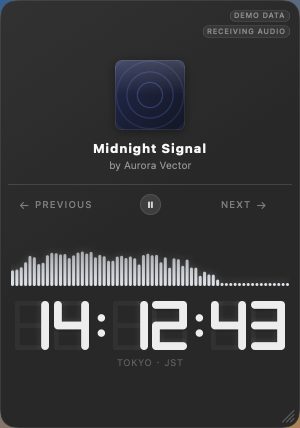

<div align="center">

# Music HUD

A translucent desktop music HUD for macOS: Apple Music now-playing info, a real-time
audio spectrum, and a retro digital display, combined into one small always-on-top
glass card that sits on your wallpaper.

**🇺🇸 English README** | [🇨🇳 中文 README](README_zh-CN.md)

</div>



---

## Requirements

* macOS 14.0 or later (developed and verified on **macOS 15.5**, Apple Silicon)
* Xcode 16 or the matching Swift toolchain (verified with **Swift 6.1.2 / Xcode 16.4**)

No third-party dependencies.

---

## Build and run

```bash
./scripts/build-app.sh release
open "build/Music HUD.app"
```

Or for a development cycle: `swift build && swift run MusicHUD`

---

## Using it

The app runs as an **accessory** (no Dock icon). Everything is reached from the
status-bar icon:

| Action | How |
|---|---|
| Move the card | Drag anywhere on it that is not a button |
| Resize | Drag the grip in the bottom-right corner |
| Play / pause / skip | The controls on the card |
| Show / hide | Status-bar icon → 显示 HUD / 隐藏 HUD |
| Always on top | Status-bar icon → 窗口层级 → 始终置顶（浮层） |
| Click-through mode | Status-bar icon → 鼠标穿透模式 |
| Settings | Status-bar icon → 设置… |
| Quit | Status-bar icon → 退出 Music HUD |

---

## Permission

Music HUD reads Music.app over Apple Events, so macOS requires **Automation** access.

* The prompt appears the first time the app tries to read Music.app.
* Path: **System Settings → Privacy & Security → Automation → Music HUD → 音乐**.
* When access has been refused, the card says **"Music access required"** and the
  transport row becomes an **Open System Settings** button that deep-links to
  `x-apple.systempreferences:com.apple.preference.security?Privacy_Automation`.
  That scheme and anchor are verified to be registered by System Settings on this
  system; if macOS ever moves the anchor, the call still opens System Settings, which
  is why the settings panel also spells out the manual path.
* `NSAppleEventsUsageDescription` in the bundle states exactly what is read and what is
  sent, and deliberately does **not** claim access to the user's library.

### Audio capture permission

A **second, different** permission is needed, and it is worth being precise about which
one, because it is widely misreported:

| | |
|---|---|
| TCC service | **`kTCCServiceAudioCapture`** — shown in System Settings as **"System Audio Recording"** |
| Info.plist key | **`NSAudioCaptureUsageDescription`** |
| Screen Recording | **Not required** — and never requested |
| Microphone | **Not required** — and `NSMicrophoneUsageDescription` is deliberately absent |

### Menu-bar utility behaviour

The app runs as an accessory: no Dock icon, no main menu bar, one status item.

```
显示 HUD / 隐藏 HUD
窗口层级 · 鼠标穿透模式 · 重置窗口位置
设置… ⌘,     音频诊断… ⌘D
版本 <version>              ← read from Info.plist, never hardcoded
退出 Music HUD ⌘Q
```

Hiding the HUD does **not** quit the app and does not stop audio analysis. Quit is
`NSApp.terminate`.

---

## Information hierarchy + world clock

### The two display modes

| Mode | Digits | Caption |
|---|---|---|
| **Track** | whatever `ClockMode` is configured (elapsed / progress / local time) | `TRACK` |
| **World clock** | that city's wall-clock time | `TOKYO · JST` |

Clicking the large display advances the rotation: Track → Tokyo → Shanghai →
London → New York → Los Angeles → Track. Disabled cities are skipped, and Settings can
enable, reorder, add and remove them. The interaction is a plain tap with no
transition animation.

### Time zones, and one SDK limitation worth recording

All conversion goes through `TimeZone`; **no UTC offset is computed by this project**,
and DST comes from the system database via `isDaylightSavingTime(for:)`.

Abbreviations were verified on macOS 15.5 rather than assumed, and the result is not
what the obvious API suggests:

| City | `TimeZone.localizedName` returns | Shown |
|---|---|---|
| New York | `EST` / `EDT` | system value |
| Los Angeles | `PST` / `PDT` | system value |
| **Tokyo** | `GMT+9` | `JST` (curated) |
| **Shanghai** | `GMT+8` | `CST` (curated; no DST) |
| **London** | `GMT` / `GMT+1` | `GMT` / `BST` (curated) |

---

## Architecture

```
MusicTimerWigdet/
├── Package.swift
├── Sources/
│   ├── MusicHUDCore/                 # Pure logic. No AppKit, no SwiftUI. Unit tested.
│   │   ├── AppleMusic/
│   │   │   ├── TrackMetadata.swift        # TrackMetadata, PlaybackState, NowPlayingSnapshot
│   │   │   ├── NowPlayingProviding.swift  # Provider protocol + MockNowPlayingService + DemoLibrary
│   │   │   ├── MusicClient.swift          # The narrow seam to Music.app + error mapping
│   │   │   ├── MusicAvailability.swift    # The three distinct failure states
│   │   │   ├── AppleEventDecoding.swift   # Descriptor → model, where the subtle bugs live
│   │   │   ├── AppleMusicNowPlayingService.swift  # Polling, track changes, artwork
│   │   │   ├── PositionEstimator.swift    # Transport-gated playhead interpolation
│   │   │   ├── SessionClock.swift         # Real playback-time accumulation
│   │   │   ├── ArtworkCache.swift         # LRU cover cache
│   │   │   └── MockMusicClient.swift      # Test double: no Music.app required
│   │   ├── Audio/
│   │   │   ├── AudioAnalysis.swift        # The audio → renderer contract (Phase 4)
│   │   │   ├── AudioLevel.swift           # AudioLevel, AudioCaptureState, AudioCaptureResult
│   │   │   ├── AudioLevelCalculator.swift # PCM → RMS / peak, and dBFS
│   │   │   └── AudioCaptureSource.swift   # Music.app process vs whole system
│   │   ├── Rendering/                     # HUDMetrics, SevenSegment, formatters, palettes
│   │   └── Settings/                      # HUDSettings + store + sanitisation
│   └── MusicHUD/                     # The application.
│       ├── main.swift
│       ├── App/                      # AppDelegate, AppState, ViewSnapshotter, StateTracer
│       ├── AppleMusic/AppleScriptMusicClient.swift   # The only file that sends Apple Events
│       ├── Audio/
│       │   ├── CoreAudioTapCapture.swift  # The only file that touches Core Audio taps
│       │   └── AudioCaptureService.swift  # State machine, retry policy, diagnostics log
│       ├── Window/                   # Panel, controller, levels, blur
│       └── UI/                       # All SwiftUI views + AudioDiagnosticsView
├── Tests/MusicHUDCoreTests/
├── tools/AudioCaptureProbe.swift     # Standalone Phase 3 verification probe
└── scripts/                          # env, build-app, build-tools, test, snapshot
```
